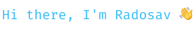

    

    

<h2>💡 About me</h2>

Software Engineer focused on backend systems, Kubernetes, and Platform Engineering.

Currently working in Release Management / DevOps, with a strong focus on improving deployment pipelines, system reliability, and cloud infrastructure.

Actively expanding expertise in Kubernetes (CKA), Google Cloud, Linux systems, and modern backend architecture.

<h2>🍀 Currently learning</h2>

<ul>
    <li>Kubernetes and preparing for Linux Foundation CKA (Certified Kubernetes Administrator) certification</li>
    <li>Google Cloud and preparing for Google Associate Cloud Engineer certification</li>
    <li>Linux System Administration and Infrastructure</li>
    <li>Platform Engineering, CI/CD and Release Management practices</li>
</ul>

<h2>💻 Tech Stack</h2>

<h3>⚙️ Programming and Markup Languages</h3>

      
      
      
      
      

<h3>📦 Frameworks and Libraries</h3>

      
      
            
      
      
      
                    
            

<h3>☁️ Cloud, DevOps and Platform Engineering</h3>

    
    
    
    
    
    
    
    

<h3>🗄️ Databases</h3>

    
        

<h3>🔗 Contact & Links</h3>

    <a href="https://www.linkedin.com/in/radosav-panic" target="_blank">LinkedIn</a> |
    <a href="https://radosav-panic.vercel.app/" target="_blank">Portfolio</a>

